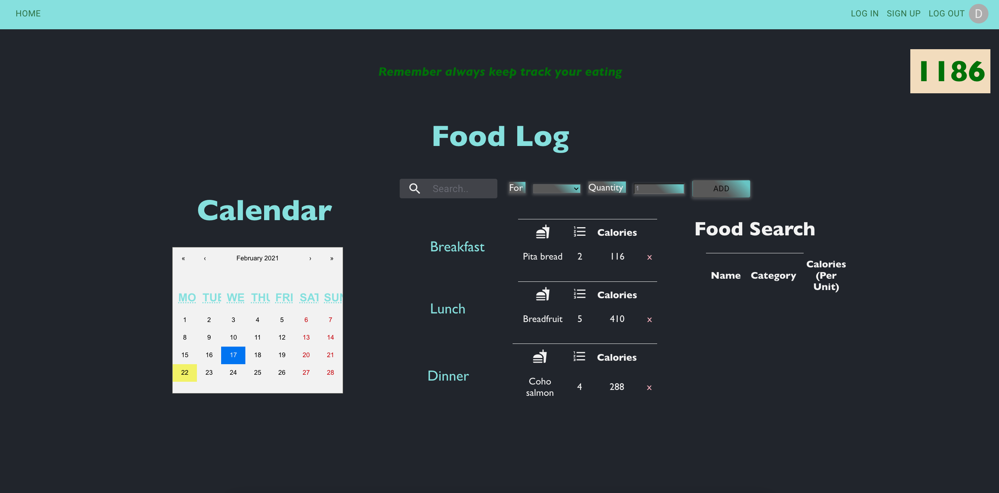

# Flat Tracker Pal App (React/ Rails API Application)

* Here is the Frontend repo of this app. Link to [Backend Repo](https://github.com/chinguyen21/flat-tracker-pal-back-end)

A tracker calories application inspired by my personal need. It was made with ReactJS, Ruby, Rails, Javascript, Postgresql, Material UI, API, and CSS

## TOOL

1. React
2. Ruby
3. Rails API
4. Javascript
5. Active Record
6. PostgreSQL
7. Bcrypt + JSON Token
8. Material UI
9. CSS
  

## INTRUCTIONS

1. Clone this repository
2. Using the terminal navigate to the root directory
3. Run "Bundle Install", then "rails server" from backend directory
5. Run "npm install", then "npm start" from frontend directory

## FEATURES

* Without sign up or log in, users can read the update to date news about fitness, health, and nutrition.
* When sign up or log in successfully, users can see their Food Log and automatic updated Calories Score on the right corner of the screen.
* Users can search for the food they want to add to their log. Food will appear with information likes categories, calories.
* Users can add food for their breakfast, lunch, and dinner on their chosen day in the calendar. Then the target calories for that day will decrease.
* Users can delete any food log of a day. Then the target calories for that day will increase.
* Users can click different days on the calendar to see their record food log.

## PREVIEW

* After log in or sign up

### Built by Chi Nguyen and Avelon Pang

